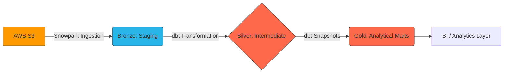

# 🏛️ Enterprise ELT Data Pipeline (AWS S3 → Snowflake → dbt)

## 🎯 Project Overview
This repository implements a **scalable, production-grade ELT pipeline** that synchronizes transactional e-commerce data from AWS S3 into an analytical Star Schema in Snowflake. 

Designed for **Architectural Resilience** and **Strategic Insight**, the platform leverages a zero-DDL dynamic ingestion framework, handles complex data governance (PII Masking & RBAC), and builds a modular, fully tested Kimball dimensional model.

---

## 🏗️ Architecture Snapshot
The mission-critical ELT process is orchestrated through a high-performance **Medallion Architecture** (Bronze, Silver, Gold):

Detailed architectural diagrams and tech stack justifications are available in the [**Architecture Overview**](./docs/architecture.md).

---

## 🛠️ Tech Stack & Strategic Decisions
- **Snowflake (Warehouse)**: High-performance compute engine with compute isolation.
- **AWS S3 (Landing)**: Durable object storage for raw ingestion.
- **dbt Core (Modeling)**: Modular SQL transformation and automated testing.
- **Apache Airflow (Orchestrator)**: Automated scheduling and failure management.
- **Snowpark Python (Ingestion)**: Dynamic schema inference to handle schema drift.

---

## 🚀 Quick Start
For new engineers, refer to the [**Developer Onboarding & Setup**](./docs/architecture.md#onboarding) to initialize your local dbt environment and run your first pipeline in under 30 minutes.

### Project Structure:
- `/airflow`: Orchestration DAGs and operational configs.
- `/docs`: Deep technical manuals and runbooks.
- `/models`: Core dbt transformation logic (Kimball modeling).
- `/snowflake`: SQL infrastructure scripts (RBAC, Ingestion procs).

---

## 🔄 Data Pipeline Summary
1.  **Extract & Load**: Asynchronously landing CSV/JSON from S3 into Snowflake Raw.
2.  **Schema Inference**: Automated relational creation via Snowpark Python.
3.  **Governance**: Enforcing PII masking and RBAC on landing.
4.  **Historization**: Capturing SCD Type 2 state changes via snapshots.
5.  **Modeling**: Materializing business-ready Facts and Dimensions.
6.  **Verification**: Executing 68+ automated data quality tests.

> [!TIP]
> For a detailed technical trace of these transitions, see the [**Life of a Record (Data Flow)**](./docs/data_flow.md) manual.

---

## 📖 Detailed Documentation

The following technical manuals provide implementation-level detail for each pillar of the ecosystem:

| Manual | Functional Responsibility |
| :--- | :--- |
| 🗺️ [**Architecture**](./docs/architecture.md) | Logical Medallion layers, Physical Cloud topology, and Tech Stack justifications. |
| 🛤️ [**Data Flow**](./docs/data_flow.md) | Technical "Life of a Record" narrative tracing data from S3 through to Gold Marts. |
| 📥 [**Data Ingestion**](./docs/ingestion.md) | Snowpark dynamic schema inference, S3 external stages, and idempotency tracking. |
| 🛠️ [**Transformation**](./docs/transformation.md) | dbt materialization strategies (Incremental/Snapshot), macros, and Jinja paradigms. |
| 📐 [**Data Modeling**](./docs/data_modeling.md) | Kimball Star Schema design, Surrogate Key (MD5) strategy, and SCD Type 2 tracking. |
| 📅 [**Orchestration**](./docs/orchestration.md) | Airflow DAG dependency design, TaskGroup organization, and environment reliability. |
| ✅ [**Data Quality**](./docs/data_quality.md) | 68+ automated tests via `dbt-expectations`, Freshness SLAs, and source auditing. |
| 📈 [**Observability**](./docs/observability.md) | Performance monitoring, Data SLAs, and Snowflake `AUDIT.CONTROL` logging. |
| 🛡️ [**Security**](./docs/security.md) | Snowflake RBAC hierarchy, Dynamic Data Masking (PII), and PoLP enforcement. |
| 🚀 [**CI/CD**](./docs/ci_cd.md) | GitHub Actions automation, Slim CI (state:modified), and PR verification logic. |
| 💰 [**Cost Optimization**](./docs/cost_optimization.md) | Micro-Partition pruning, clustering, and Warehouse auto-suspend strategies. |
| 🛠️ [**Runbook**](./docs/runbook.md) | Operational failure recovery, manual backfill strategies, and system maintenance. |
| 📖 [**Glossary**](./docs/glossary.md) | Unified terminology for technical and business-facing data concepts. |

---

## 📈 Final Deliverables
Successfully materializing the **Analytical Marts** allows business users to drive ROI directly via SQL:
- **LTV & RFM Metrics**: Identifying high-value customers.
- **Revenue Geometry**: Mapping geographic growth against static dimensional seeds.
- **Historical Auditing**: Reconstructing past state via SCD Type 2 tracking.
