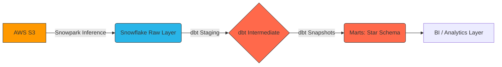

# Enterprise ELT Data Pipeline (AWS S3 → Snowflake → dbt) 🚀


A production-grade, end-to-end ELT pipeline processing e-commerce data. This project implements a **zero-DDL dynamic ingestion framework** using Snowpark, handles complex data governance (RBAC & PII Masking), and builds a modular, fully tested Kimball dimensional model using dbt.

## 🎯 Project Goal

The primary objective of this project is to build an automated and robust Data Warehouse for an e-commerce platform. The system needed to:
1. **Automate Ingestion:** Ingest raw CSV and JSON files from AWS S3 dynamically without having to manually write `CREATE TABLE` and schema drift tracking statements.
2. **Secure PII:** Implement enterprise-grade security (Role-Based Access Control and Dynamic Data Masking) to protect sensitive Customer Information (Emails/Phones).
3. **Model Data:** Transform the messy raw data into a clean Star Schema (Facts and Dimensions), while tracking slowly changing dimensions (SCD Type 2) for historical accuracy.
4. **Ensure Quality:** Enforce zero-tolerance data quality checks before data reaches business analysts.

---

## 🏛️ Architecture Overview

The ELT process is broken down into three main phases: **Extract/Load** (Snowpark & Snowflake Streams), **Transform** (dbt), and **Orchestrate/CI/CD** (Airflow & GitHub Actions).



---

## 📦 Initial Data & Domain

The raw data arrives in an **AWS S3 Bucket** mimicking transactional output from an e-commerce microservices architecture.

| Entity | Format | Key Fields | Complexity |
|--------|--------|------------|------------|
| **Orders** | `CSV` | `order_id`, `customer_id`, `status`, `amount`, `dates` | Requires deduping & type-safe standardisation. |
| **Order Items**| `CSV` | `order_item_id`, `product_id`, `quantity`, `price`, `discount_pct` | Nested metrics derived dynamically. |
| **Customers** | `JSON` | `customer_id`, `email`, `phone`, `loyalty_status` | Nested arrays requiring flattening; contains PII. |
| **Products** | `CSV` | `product_id`, `category_id`, `unit_cost_usd` | Standard dimensions requiring surrogate lookups. |

---

## 🛠️ Implementation & Technical Approaches

### 1. Dynamic Ingestion (Snowpark Python)
Instead of rigidly defining the raw layer, we used **Snowflake's `INFER_SCHEMA`** wrapped inside a custom Python Stored Procedure. 
- The pipeline scans new files arriving in the S3 external stage.
- It dynamically identifies the columns, builds the target table internally, and infers correct data types (e.g., distinguishing between `NUMBER(5,2)` and `VARCHAR`).
- Files are logged in an idempotency tracking table (`FILE_INGESTION_LOG`) to guarantee files are never loaded twice.

### 2. Snowflake Security & Governance
A robust RBAC architecture was scripted entirely in SQL:
- Dedicated Service Accounts (`SVC_LOADER`, `SVC_TRANSFORMER`).
- Strict separation of compute instances (`LOADER_WH`, `TRANSFORMER_WH`, `ANALYST_WH`).
- **Dynamic Data Masking**: PII columns like `email` and `phone` are masked for standard analysts (`***@example.com`), but visible to privileged Transformer service accounts.

### 3. dbt Transformation (Bronze to Gold)
We adhered strictly to dbt best practices:
- **Seed Layer:** Bootstrapped static dimensions (`country_codes.csv`, `product_categories.csv`).
- **Staging Layer (Bronze):** Implemented incremental logic using `is_incremental()`, deduplicated records using `QUALIFY ROW_NUMBER()`, and cast dynamic inference back into safely bounded constraints.
- **Snapshot Layer:** Enabled Slowly Changing Dimensions (SCD Type 2) to track historical fluctuations in a Customer's loyalty status over time.
- **Intermediate Layer (Silver):** Applied complex aggregation (e.g. Lifetime Value LTV, Recency-Frequency-Monetary RFM segmentation) to decouple business logic from final representations.
- **Marts Layer (Gold):** Built highly performant Fact (`fct_orders`) and Dimension (`dim_customers`, `dim_products`) tables using Surrogate Keys and native clustering for BI consumption.

### 4. Data Quality & Testing (68+ Tests)
The pipeline is fortified by a robust test suite using native and custom generic testing:
- **Schema tests:** Primary Key constraints (`unique`, `not_null`), enforced `accepted_values` (e.g., Status can only be 'pending', 'shipped', 'cancelled', etc.).
- **dbt-expectations:** Validating numeric thresholds (e.g. order quantities > 0).
- **Singular cross-layer tests:** Built complex SQL tests to ensure the sum of `order_items` matched the gross total flagged on `fct_orders`.

### 5. Orchestration & CI/CD
- **Airflow:** Deployed DAGs with `apache-airflow-providers-snowflake` to trigger the Python ingestion pipeline and subsequent dbt builds every 15 minutes.
- **GitHub Actions:** Integrated Slim CI/CD. The pipeline leverages `dbt --select state:modified` to automatically run format checks, compile tests, and dry-run code changes instantly on Pull Requests.

---

---

## 📖 Documentation & Guides

For a thorough deep-dive into the pipeline architecture, data journey, and step-by-step setup, refer to the following documentation:

- 🛤️ [**Step-by-Step Data Journey**](./docs/DATA_TRANSFORMATION_JOURNEY.md): Visualize how a single record evolves as it moves through the Bronze, Silver, and Gold layers of our warehouse.
- 🚀 [**Project Walkthrough (Idea & Strategy)**](./docs/PROJECT_WALKTHROUGH.md): A conceptual overview explaining the "Why" and "How" of this project, including our tech stack and final goals.
- 📘 [**Step-by-Step Execution Guide**](./docs/EXECUTION_GUIDE.md): Complete instructions for standing up the AWS Bucket, Snowflake Environment, and local dbt setup from scratch.

---

## 🚀 How to Run the Project

Once the initial setup from the [**Execution Guide**](./docs/EXECUTION_GUIDE.md) is complete, you can execute the entire pipeline locally using these commands:

### Quick Run Sandbox
If you have correctly mapped your `profiles.yml` and Snowflake environment variables, you can test the pipeline locally:
```bash
# 1. Install packages and set up static seeds
dbt deps && dbt seed

# 2. Stage the raw data from Snowflake and track dimensional history
dbt run --select tag:staging
dbt snapshot

# 3. Build intermediate aggregates and final reporting marts
dbt run --select tag:intermediate
dbt run --select tag:marts

# 4. Verify data integrity against all 68+ assertions
dbt test

# 5. Generate and review interactive documentation
dbt docs generate && dbt docs serve --port 8080
```

---

## 📈 Final Deliverables
Once successfully executed, Data Analysts can utilize the completed `ANALYTICS.MARTS` schema to derive answers directly via standard SQL:
- Churn Analysis & Retention Models based on SCD2 tracking.
- Cohort revenue plotting.
- Geographic LTV segmentations mapping `DIM_CUSTOMERS` back to the Country Code static seeds.
