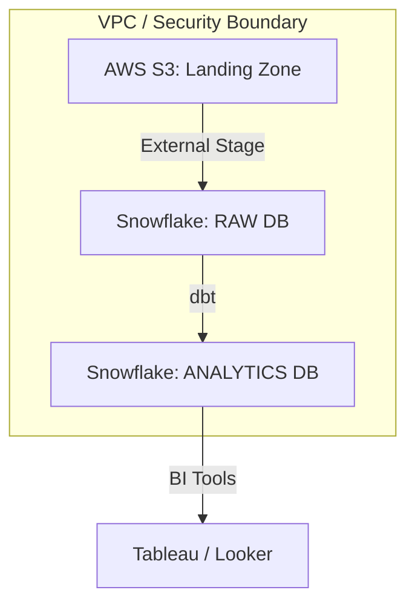

# 🏛️ Architecture Specification

## 📑 Overview
Our data infrastructure is designed as an **ELT-first Medallion Architecture**, leveraging Snowflake's **Decoupled Compute and Storage** to provide infinite horizontal scalability with zero resource contention.

---

## 🏗️ Logical Architecture: The Medallion Lifecycle

| Layer | Functional Role | Data State | Standard Materialization |
| :--- | :--- | :--- | :--- |
| **Bronze** | Staging | Cleaned and Normalized Raw | Views (Dev) / Tables (Prod) |
| **Silver** | Intermediate | Business Logic & Metric Enrichment | Tables |
| **Gold** | Marts | Kimball Star Schema (Fact/Dim) | Tables (Clustered) |

### Key Principles:
1. **Uniqueness at Source**: Every business entity (Orders, Customers) is deduplicated at the Bronze layer to prevent downstream fan-out.
2. **Immutability of History**: Snapshots capture Type 2 SCD changes, preserving historical state for temporal analysis.
3. **Semantic Decoupling**: Business definitions (e.g., LTV, RFM) are siloed in the Silver layer, ensuring the Gold layer remains a thin presentation layer.

---

## 🌐 Physical Architecture: Cloud Infrastructure

### Components:
- **AWS S3**: Durable, serverless object storage for raw events.
- **Snowflake Service (AWS Managed)**: Multi-cluster, shared-data warehouse.
- **Airflow Worker**: External compute node (AWS EC2 / Kubernetes) running dbt and managing stateful task transitions.

---

## 🛠️ Strategic Tech Stack Rationale

| Technology | Architectural Rationale |
| :--- | :--- |
| **Snowflake** | Native support for semi-structured data (JSON) and zero-copy cloning for CI/CD environments. |
| **dbt Core** | Enables "Data-as-Code" via Jinja-templated SQL and modular testing. |
| **Airflow** | Provides programmatic DAG definitions and robust retry logic for distributed system reliability. |
| **Snowpark** | Offloads complex, dynamic schema-inference logic to Snowflake's compute engine, minimizing data egress. |

---

## 💰 Cost Optimization & Performance Tuning (Snapshot)
Detailed cost strategies are available in [**cost_optimization.md**](./cost_optimization.md).
- **Auto-Suspend**: Configured for 60-second idle timeouts across all project warehouses.
- **Clustering**: Analytical fact tables are clustered by temporal and business-key partitions.

---

## 🚦 System Constraints & Boundaries
- **Late-Arriving Data**: Handled via a 3-day lookback window in incremental models.
- **Concurrency**: Managed via Snowflake Multi-Cluster Warehouse (MCW) auto-scaling.
- **Isolation**: Workspaces are physically isolated into `DEV`, `TEST`, and `PROD` databases.
