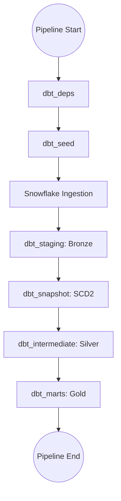

# 📅 Orchestration Architecture: `Apache Airflow`

## 📑 Strategy: Programmatic Data Pipelining
The **`elt_pipeline`** DAG acts as the central heartbeat of our analytical stack. It coordinates stateful transitions from AWS S3, through Snowflake Ingestion Tasks, into our multi-layered dbt model.

---

## 🏗️ DAG Design & Dependency Topology
Our DAG follows a linear, predictable data gravity flow. It uses **TaskGroups** to isolate different dbt materialization phases for improved observability.



### Key Components:
- **`dbt_deps`**: Ensures all external macro packages (e.g., `dbt-utils`, `dbt-expectations`) are pre-installed and consistent across every worker.
- **`snowflake_ingestion`**: An Airflow `SQLExecuteQueryOperator` that triggers Snowflake Tasks. It includes a polling strategy to confirm data is fully relationalized before dbt execution.
- **`dbt_snapshot`**: Must execute **after** staging but **before** intermediate models.

---

## 🛠️ Operational Resilience: Technical Decisions

### 1. Environment Variable Export (`set -a`)
To prevent "Credentials Missing" errors in distributed Airflow setups, all BashOperators use an **export模式**:
```bash
set -a; source {{ PROJECT_ROOT }}/.env; set +a && dbt run ...
```
> [!IMPORTANT]
> **Why?** Airflow shell operators run in a sub-shell. Without `set -a` (Export mode), standard `.env` variables are not inherited by the `dbt` binary.

### 2. Failure Notifications (`on_failure_callback`)
Any task failure triggers a Python callback that parses the `context` and prints critical information (DAG ID, Task ID, Log URL) to the scheduler log. This is extensible to Slack/PagerDuty.

---

## 🚦 Governance & Scheduling
- **Frequency**: Every 15 minutes (`*/15 * * * *`).
- **Retries**: 2 retries per task with **Exponential Backoff**.
- **Timeouts**: 2-hour timeout per TaskGroup.
- **Catchup**: `catchup=False` to prevent queuing multiple old runs.
